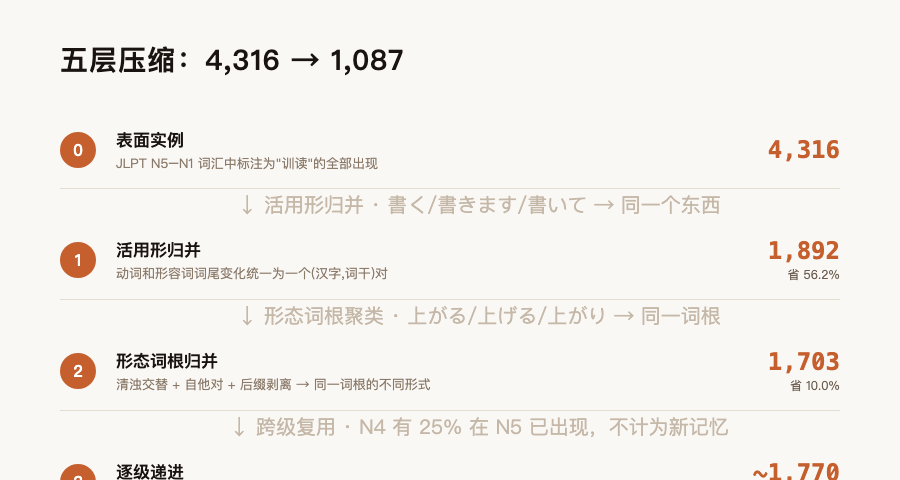
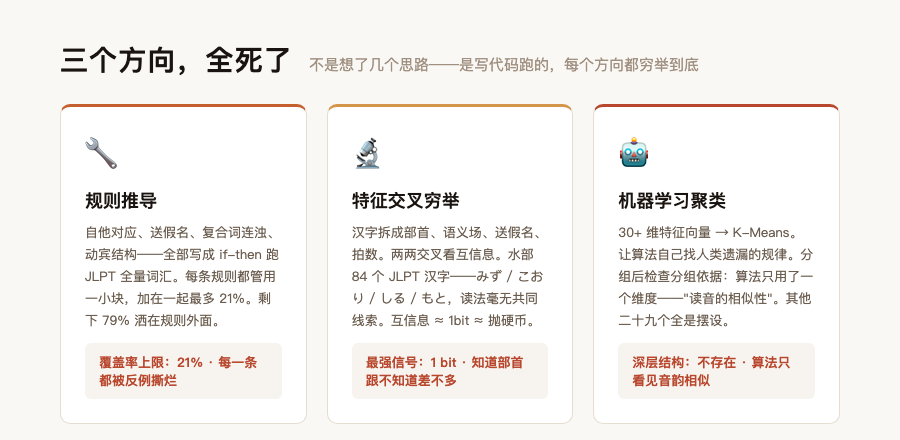
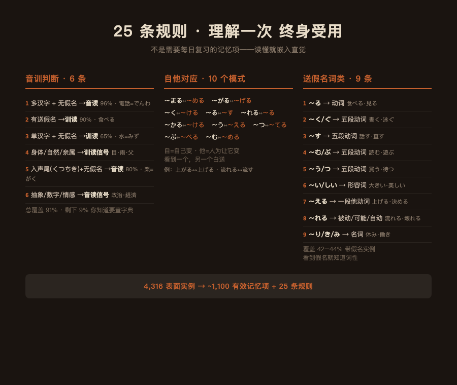
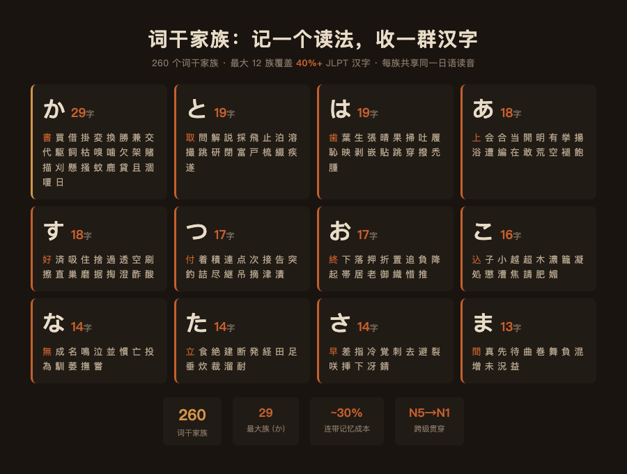
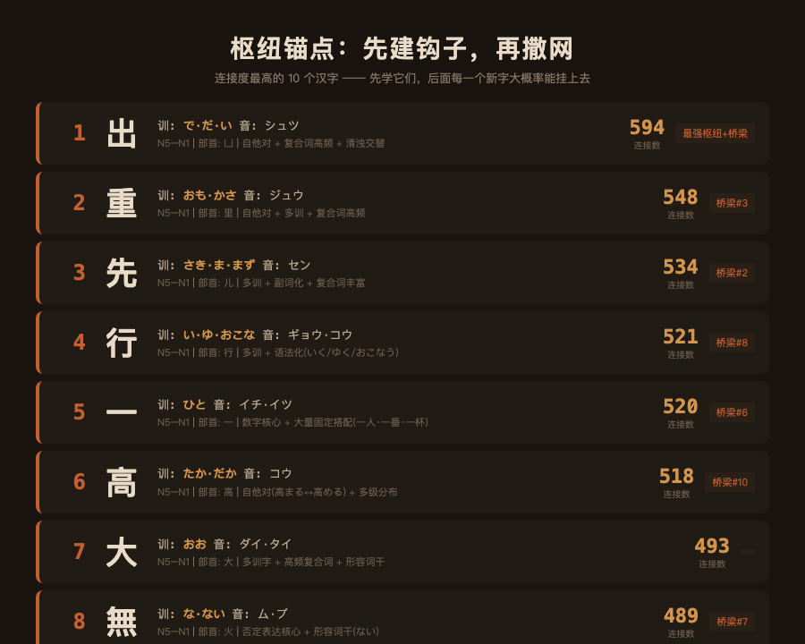
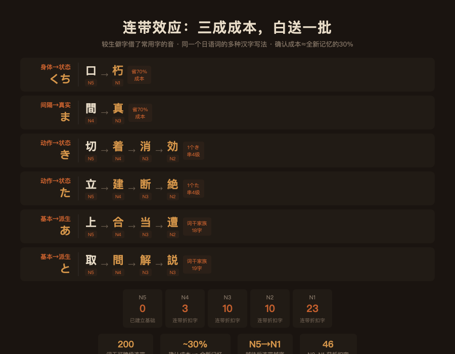
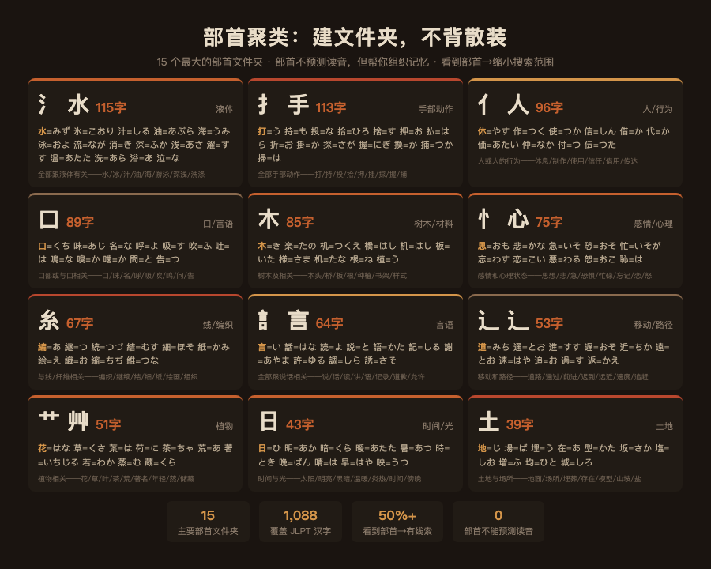
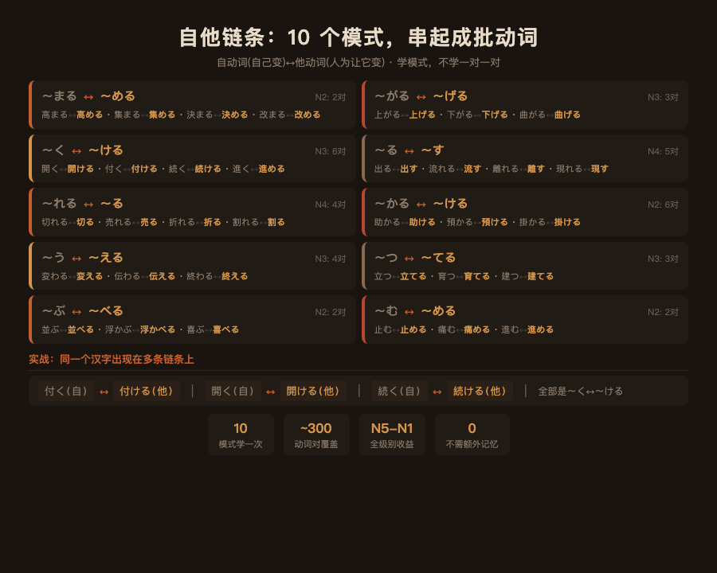
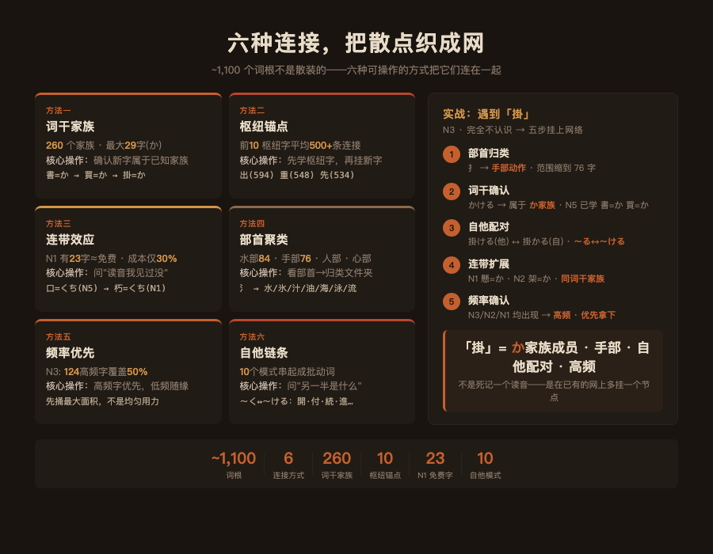

# 训读没有规律

训读没有规律。

先看一个例子。「高める」和「高まる」。一个意思是"人为让它变高"，一个是"自己变高"。你又发现了「集める↔集まる」「決める↔決まる」——稳了，这条规则一定管用。然后你遇到「求める」。自动词是什么？没有。「認める」？也没有。「眺める」？也没有。我替你把 JLPT 全部词汇跑了一遍：这条规则能管的，不到 12%。剩下 88%，不管用。

不是这条规则不争气。所有规则都这样。

三个方向，三十多个维度，全跑完了。结论就一句：**训读不存在全局推导规则。**

但这不是坏消息。因为我发现了一件更重要的事：JLPT 词汇表里，四分之三的训读实例根本不需要记。4,316 个表面实例，压缩到约 1,100 个。

这篇文章说清楚两件事。为什么没有规律——替你省下找口诀的时间。为什么你不需要规律——该记的，不到你以为的四分之一。

---

你打开 Anki，今天要背 50 张卡。每张卡上一个汉字，两三种读法。这张是「書」——昨天读「か」、今天读「しょ」。你已经分不清哪个是音读哪个是训读。也不知道「書きます」和「書いて」为什么要各占一张卡。

你盯着屏幕，开始怀疑一件事——我记忆力是不是有问题？

不是你记忆力有问题。是从来没有人告诉你，这些卡里有多少张根本不应该存在。

市面上你听到两种声音。一种说"训读只能死记硬背"。另一种说"记住这五句话，训读规律全掌握"。没有人告诉你第三种可能："我去验证过了。确实不存在推导公式。但你也不需要它。"

先回到一个更根本的问题。

「訓読み」这个词本身就在误导你。听起来像是"汉字的日本发音"——每个汉字自带一种或几种日语读法，你的任务是把它们配对记住。

不是这样的。

日语里有一个动词，读作「はかる」。意思是"量""测""估计"。当你用它称重量，写成「量る」。测长度，写成「測る」。图谋不轨，写成「謀る」。日语里只有一个「はかる」，但根据使用场景，选不同的汉字来写。

你不需要记"三个汉字的三个训读"——那是把关系搞反了。**你学的是一个日语词「はかる」，它有三种汉字写法。训读不是汉字的日本发音，是和语词的汉字书写方式。**

把这个视角扭过来。扭过来之后，一堆你以前觉得混乱不堪的东西突然清楚了。

---

接下去是你最关心的问题：那四分之三怎么省掉的。

先从最大的一块说起。活用形。

「切」这个字，在 JLPT 词汇表里出现了七次：きる、きり、き、ぎる、ぎり、ぎ、ぎれる。七个条目，每个标的都是"训读"。你以为要记七个。

实际上它们全来自一个词根：「き」。日语里清音和浊音会交替——き↔ぎ，同一个东西。不同的活用和派生后缀——〜る、〜り、〜れる——给同一个词根换上不同的马甲。七种露面形式，一个词根。一次记住「切=き」，七个全收。

这套机制不只「切」有。日语动词和形容词的词尾变化是系统性的——書く、書きます、書いて、書いた、書けば，全是同一个「か」换衣服。**活用形是语法，不是词汇。语法替你管了，你不用管。**

光这一层，4,316 个表面实例减到 1,892 个。超过一半不见了——不是被技巧省掉的，是活用形本来就不该被当成独立记忆项来计数。

再往下。自他对应。

日语里有一类动词专门描述"自己变成那样"——自动词。另有一类描述"人为让它变成那样"——他动词。这两类之间有固定的形态挂钩。你学到其中一个，另一个白送。

十个模式，学一次终身受用：上がる↔上げる、流れる↔流す、開く↔開ける、出る↔出す、切れる↔切る、変わる↔変える、立つ↔立てる、並ぶ↔並べる、止む↔止める、助かる↔助ける。

看到〜める结尾，自动词大概率是〜まる。看到〜げる结尾，自动词大概率是〜がる。不是一条一条记，是一个模式管一批。在 N2 级别，这套对应覆盖了超过十分之一的训读实例。

再来看送假名。所谓送假名，就是跟在汉字后面的那些假名尾巴，比如「食べる」的「べる」、「大きい」的「きい」。

这些假名尾巴不只是在装饰——它们直接暴露了词类。看到〜い/〜しい，形容词。看到〜く/〜ぐ/〜す/〜む，五段动词。看到〜える，一段他动词。看到〜れる，被动或自动。看到〜り/〜き/〜み，名词——从动词连用形转过来的。

九条规则。看到假名就知道词性——眼睛扫到的，不需要记。

最后，形态派生。日语有一个特点：同一个词根，后面粘不同的后缀，变出动词、名词、形容词。粘着语——这个词听起来吓人，但意思很简单：单词像乐高积木，一块块往后拼。上がる（自己上升）→ 上げる（抬起）→ 上がり（上涨）。一个词根 a-，三种语法形式。

活用形、自他对应、形态派生、送假名——四样加在一起，4,316 砍到 1,703。省掉的两千六百多个，不是靠什么高级技巧，是日语这门语言自带的。你只是被传统的呈现方式误导了，以为它们需要一个个去记。

---

剩下 1,703 个词根。也不是一盘散沙。

先说顺序。按 N5→N4→N3→N2→N1 逐级往上走，每进一级，你会发现上一级学过的词根大量复现：N4 有 25% 在 N5 已经见过了。N3 有 40%。到了 N2，复用率冲到 47%——学 N2 的时候，将近一半的东西不是新的。越到后面，真正的新东西越少。

再说频率。N3 级别有 528 个不同的汉字出现了训读——但其中 124 个就覆盖了全部 N3 训读的一半。先拿下这 124 个高频字，花最少的时间捅最大的面积。

还有一个你越到后面越明显的好处：学到后面，前面学的字会帮你。学了「口=くち」（N5），再遇到「朽=くち」（N1），你不是在记新东西。你只是在确认一句"朽的训读跟口一样"。这个确认不费力——大约是新记忆三成的成本。到了 N1，有 23 个汉字因为和前面学过的字共享词干，基本等于白送。

---

现在，回到开头。我说三个方向全死了。具体是怎么回事——这部分的结论，比前面任何一条都值钱。因为它帮你省掉的时间不是"背"的时间，是"找"的时间。

第一个方向，规则推导。把能想到的语法模式全写成 if-then 跑数据。自他对应、送假名、复合词连浊、动宾结构——每一条规则都管用一小块，加在一起最多覆盖 21%。剩下 79% 洒在规则外面，你每次以为发现了新模式，反例马上跳出来打脸。

第二个方向，特征交叉。把汉字拆成部首、语义场、送假名、拍数，两两交叉看关联。拿「水」部举例——84 个带水部的 JLPT 汉字。有读「みず」的（水），读「こおり」的（氷），读「しる」的（汁），读「もと」的（求）。你找不到任何共同的线索。统计结果也这么说——你看了部首之后再猜读法，跟你抛硬币猜正反差不多。知道语义场也一样——你知道一个词是"身体部位"，不能帮你预测它读什么。

第三个方向，让机器自己找。每个训读实例抽出三十多种特征，全部喂给聚类算法，看有没有人类漏掉的规律。算法跑完之后，检查它到底是按什么分的组——三十个维度里，它只用了一个：读音的相似性。其他二十九个——部首、语义、级别、送假名——全是摆设。算法比我诚实。它说，深层结构？不存在。

三条路走到尽头。得到的不是一个公式，是五个确凿的结论。每条都在帮你止损：

**形近字读半边？在训读里不管用。** 带同一个部首的汉字，读法互相不挨着，只有 0.2% 到 0.6% 的概率共享读法。"训读声旁"这个概念可以扔了。

**部首猜训读？不管用。** 水部 84 个字，读音散得毫无规律。

**语义猜训读？不管用。** 你知道"身体部位大概率是训读"，但具体读什么，语义不告诉你。

**机器学习挖出了人类看不见的深层规律？没有。** 三十多个维度跑完，聚类只看见音韵相似性。

**送假名能推出读法结尾？不能。** 假名能告诉你词性——动词还是形容词——不能告诉你词根怎么念。

每一条都是一堵墙。你不需要去撞。

---

好。你说，那我能怎么办。

你能做的比你以为的多。而且不需要额外的记忆量。

先说不需要记什么——25 条规则，理解一次，终身受用。

**音训判断，6 条。** 看到一个带汉字的日语词，第一秒分清楚走音读还是训读：

1. 多汉字 + 没有假名尾巴 → 音读（靠谱率 96%）。「電話」两个汉字没有假名，音读，でんわ。
2. 有假名尾巴 → 训读（靠谱率 90%）。「食べる」有「べる」，训读。
3. 孤零零一个汉字，没假名 → 七成是训读。「水」単字，训读，みず。
4. 身体部位、自然物、亲属称谓 → 训读，几乎不出意外。「目」「雨」「父」。
5. 汉字尾巴是 く/つ/ち/き 还没假名 → 大概率音读（靠谱率 80%）。「楽」がく。
6. 抽象概念、数字 → 倾向音读。「政治」「経済」「自由」。

六条。覆盖 91% 的 JLPT 词汇。剩下 9% 你知道要查字典——而不是面对所有词都茫然。

**自他对应，10 个模式。** 自动词（自己变）和他动词（人为让它变）之间的固定形态挂钩。看到一个，另一个白送：

| 自动词尾 | 他动词尾 | 例 |
|---------|---------|-----|
| 〜まる | 〜める | 高まる↔高める |
| 〜がる | 〜げる | 上がる↔上げる |
| 〜く | 〜ける | 開く↔開ける |
| 〜る | 〜す | 出る↔出す |
| 〜れる | 〜る | 切れる↔切る |
| 〜かる | 〜ける | 助かる↔助ける |
| 〜う | 〜える | 変わる↔変える |
| 〜つ | 〜てる | 立つ↔立てる |
| 〜ぶ | 〜べる | 並ぶ↔並べる |
| 〜む | 〜める | 止む↔止める |

十个模式。学一次，终身受用。

**送假名词类判断，9 条。** 假名尾巴直接暴露词类，眼睛扫到就知道：

| 假名尾巴 | 词类 | 例 |
|---------|------|-----|
| 〜る | 动词 | 食べる、見る |
| 〜く/〜ぐ/〜す/〜む/〜ぶ | 五段动词 | 書く、泳ぐ、話す、読む、遊ぶ |
| 〜う/〜つ | 五段动词 | 買う、待つ |
| 〜い/〜しい | 形容词 | 大きい、美しい |
| 〜える | 一段他动词 | 上げる、決める |
| 〜れる | 被动/可能/自动 | 流れる、壊れる |
| 〜り/〜き/〜み | 名词 | 休み、働き、楽しみ |

九条。覆盖 42–44% 带假名的实例。

这 25 条规则，不是每天要复习的记忆项。是理解一次，用着用着就嵌入直觉的东西。

---

那需要刻意记的 ~1,100 个词根呢？

不是一条一条往里塞。是往一张网上挂。

我跑了全量数据之后发现，这 1,100 个词根不是散装的。它们之间有六种可以系统利用的连接方式。每一种都让下一个词根更容易记住——因为你是在已有锚点上挂新东西，不是在一片空白里硬刻。

---

## 方法一：词干家族 —— 记一个读法，收一群汉字

这是最狠的一招。

把 JLPT 全部汉字按训读词干分组之后，出现了 260 个"词干家族"——同一个日语读音，对应多个不同汉字。最大的家族有 29 个成员。

*图：260 个词干家族中最大的 12 个——か(29字) 到 ま(13字)。每族共享同一个日语读音，记一次确认一批。*

**「か」家族（29 个字）：**

書=か、買=か、借=か、掛=か、変=か、換=か、勝=か、兼=か、交=か、代=か、駆=か、飼=か、枯=か、嗅=か、噛=か、欠=か、架=か、賭=か、描=か、刈=か、懸=か、掻=か、蚊=か、鹿=か、貸=か、且=か、涸=か、嗄=か、日=か

你在 N5 学了「書=か」——書く、書き方。到 N4 遇到「買=か」——買う、買い物。你不是在记一个新读法。你只是在确认"哦，買也读 か"。到 N2 遇到「掛=か」——掛かる、掛ける。还是 か。到 N1 遇到「賭=か」——賭ける。还是 か。

一个读法，贯穿 N5 到 N1。每遇到一个新汉字，你要做的不是"背一个新读音"——是"确认这个字也属于 か 家族"。确认的成本，大约是全新记忆的三成。

**「と」家族（19 个字）：**

取=と、問=と、解=と、説=と、採=と、飛=と、止=と、泊=と、溶=と、撮=と、跳=と、研=と、閉=と、富=と、戸=と、梳=と、綴=と、疾=と、遂=と

N5 学了「取=と」——取る。N4 学到「問=と」——問う、学問。N3 出现「解=と」——解く、解決。「説=と」——説く、演説。还是同一个 と。

**「は」家族（19 个字）：**

歯=は、葉=は、生=は、張=は、晴=は、果=は、掃=は、吐=は、履=は、恥=は、映=は、剥=は、嵌=は、貼=は、跳=は、穿=は、撥=は、禿=は、腫=は

**「あ」家族（18 个字）：** 上=あ、会=あ、合=あ、当=あ、開=あ、明=あ、有=あ、挙=あ、揚=あ、浴=あ、遭=あ、編=あ、在=あ、敢=あ、荒=あ、空=あ、褪=あ、飽=あ

**「す」家族（18 个字）：** 好=す、済=す、吸=す、住=す、捨=す、過=す、透=す、空=す、刷=す、擦=す、直=す、巣=す、磨=す、据=す、掏=す、澄=す、酢=す、酸=す

怎么用这个？学到任何一个新汉字，先看一眼它是不是某个已知家族的成员。学到「換」——想「換=か？是不是跟書、買一样读 か？」翻一下词干家族表——確認、換=か。一秒钟确认，省掉一次全新记忆。

N5 学完，你已经掌握了 か、と、は、あ、す 五个大家族中的相当一部分字。从 N4 开始，每遇到一个这些家族的新成员，都是回头客，不是新客人。

---

## 方法二：枢纽字 —— 先建锚点，再撒网

有些汉字在整个网络中连接特别多——它们跟大量其他汉字共享词干、共享部首、共享复合词。先学这些字，等于先在墙上打好了钩子。后面学的每一个字，大概率能挂到这些钩子上。

*图：连接度最高的 10 个枢纽字——平均 500+ 条连接，6 个同时是跨界桥梁字，全级别覆盖。*

网络分析跑出来的前十个枢纽：

| 汉字 | 连接数 | 核心训读 | 为什么连接多 |
|------|--------|---------|------------|
| 出 | 594 | で、だ | 出现在大量复合词里（出口、出る、思い出す…） |
| 重 | 548 | おも、かさ | 自他对 + 多级词 + 复合词高频 |
| 先 | 534 | さき、ま | 多训字 + 大量复合词（先生、先ず、宛先…） |
| 行 | 521 | い、ゆ | 多训字 + 语法化（行く、行う、行方…） |
| 一 | 520 | ひと | 数字 + 大量固定搭配（一人、一番…） |
| 高 | 518 | たか | 自他对 + 多级分布 |
| 大 | 493 | おお | 多训字 + 高频复合词 |
| 無 | 489 | な | 否定表达的核心字 |
| 正 | 487 | ただ、まさ | 多训字 + 副词化 |
| 動 | 484 | うご | 自他对 + 高频动词 |

拿「出」举例。你学了「出=で」（出る、N5）。然后你会遇到：出す=だす（N5）、出会う=であう（N4）、思い出す=おもいだす（N4）、出張=しゅっちょう（N5 音读）、出来る=できる（N5 不规则）。表面看是五个不同的东西。实际核心就一个：「出」的核心意思是"出来"，读音在 で/だ 之间清浊交替。你不需要记五个——你是在一个锚点上挂五根线。

先拿下这 10 个枢纽字。它们会是你记忆网络里的第一批钩子。

---

## 方法三：连带效应 —— 三成成本，白送一批

有些汉字共享词干不是巧合——是较生僻的字借了常用字的音。

*图：6 条跨级连带链——N5 的「口=くち」到 N1 的「朽=くち」，一个读音串 4 级。越到高级连带越密，N1 有 23 字基本免费。*

「口=くち」（N5）→「朽=くち」（N1）。「朽」的意思是"腐烂"——木头烂了之后里面空了，像一张嘴。日本人说"木头朽了"的时候，用的就是 くち。你学到 N1 遇到「朽」，不需要重新记读音——你只是确认"朽的训读跟口一样"。

「間=ま」（N4）→「真=ま」（N3）。「間」是"间隙"，「真」是"真实"——两个完全不相关的意思，共享同一个词干 ま。不是你要记两次，是同一个日语词的两种汉字写法。

这种连带关系在 N3 以上越来越密集。到了 N1，有 23 个汉字因为和前面学过的字共享词干，基本等于白送。N2 有 10 个字获得连带折扣。N3 有 10 个。

具体怎么操作：学到新字，先扫一眼它的训读，问自己——"这个读音我见过没有？" 学过「消=き」（N3）→ 遇到「着=き」（N4），回想——「着る=きる」里面有 き。「聞=き」（N5）→「効=き」（N2）——効く也是 き。确认这一步不费力，但它把"从零学"变成了"确认已知"。

---

## 方法四：部首聚类 —— 建文件夹，不背散装

部首不能预测读音——前面已经确认了。但部首可以帮你组织记忆。

*图：15 个最大的部首文件夹——覆盖 1,088 个 JLPT 汉字。部首不预测读音，但告诉你含义范围，回忆时多一条线索。*

水部（氵）在 JLPT 里有 84 个字。它们的训读各不相同——読法之间没有规律。但它们在意义上全部跟"液体"有关：水=みず、氷=こおり、汁=しる、油=あぶら、海=うみ、泳=およ、流=なが、消=き、深=ふか、浅=あさ、濯=すす…

你不是在背 84 个随机读音。你是在一个"液体相关"的文件夹里归档 84 个汉字。文件夹本身不告诉你里面每个文件的名字——但它帮你缩小了搜索范围：你看到三点水，就知道这个字的含义跟液体有关。含义锚定了，回忆读音就多了一条线索。

手部（扌）76 个字——全部跟手部动作有关：打=う、持=も、投=な、拾=ひろ、捨=す、押=お、払=はら、折=お…

心部（忄/心）——感情和心理状态：思=おも、悲=かな、急=いそ、恐=おそ、忙=いそが、忘=わす…

人部（亻）——人和人的行为：休=やす、作=つく、使=つか、信=しん（音读为主）、借=か…

每遇到一个新汉字，第一步：看部首，归类到已知文件夹。第二步：看它跟文件夹里哪个已知字共享词干或部件。两步下来，大部分字已经不是"完全陌生的符号"了。

---

## 方法五：频率优先 —— 先捅最大的面积

N3 有 528 个不同汉字出现了训读。其中 **124 个高频字覆盖了全部 N3 训读的一半**。

这意味着：你不需要均匀用力。先拿下那 124 个高频字——它们会在你读 N3 材料的时候反复出现，每出现一次就是一次免费复习。剩下的 404 个低频字，等你遇到了再查——它们的出现频率低到你可能在考试前只见一两次，不值得花同等精力。

每级的帕累托分布：

| 级别 | 去重词根数 | 前20%高频字覆盖 |
|------|----------|---------------|
| N5 | 400 | ~50% |
| N4 | 417 | ~45% |
| N3 | 616 | ~50%（124字） |
| N2 | 671 | ~48% |
| N1 | 824 | ~45% |

高频字优先，低频字随缘。不是偷懒——是资源配置。

---

## 方法六：自他链条 —— 不是背一对，是串一条链

10 个自他对应模式不只是帮你省掉一半记忆量。它还能帮你把动词串成链条。

*图：全部 10 个自他模式 + 每模式 3-4 个实例 + 实战链条（付く↔付ける↔開く↔開ける↔続く↔続ける 全部是同一个模式）。*

「付」这个字：付く（自动词，东西自己附着上去）→ 付ける（他动词，人为把东西附上去）。模式是 〜く↔〜ける。学会这个模式之后，你遇到 開く↔開ける、続く↔続ける、進く→進める——全部是同一个模式。你不只是在省一半——你是在用一个语法直觉批量处理动词。

更妙的是，同一个汉字往往同时出现在多条链条上。继续用「出」：出る（自动词）↔ 出す（他动词）——这是 〜る↔〜す 模式。同时 出会う（复合动词）、出来る（语法化）。「出」这个词根的每一次露面，都不是孤立的——它在自他链条上、在复合词链条上、在清浊交替链条上，同时连着好几个方向。

你不需要刻意记住所有链条。你只需要在遇到一个新动词的时候，下意识问一句："它的自动词/他动词对应是什么？" 这个提问本身就会激活你已经学过的模式，把新旧两个词挂在一起。

*图：六种记忆连接方式全景。左：六法速查。右：以「掛」为例的五步实操——从完全不认识到挂上网络。*

---

把六种方法串起来，一个具体例子。

你第一次遇到「掛」这个字，在 N3 词汇「掛ける」里。你不认识。但你可以做这几件事：

1. 看部首——扌（手部）。手部动作。范围缩小到 76 个字。
2. 听读音——かける。か 开头。か 家族有 29 个字。你已经在 N5 学过 書=か、買=か。确认：「掛」也属于 か 家族。
3. 识别自他——掛ける 是 〜ける 结尾 → 他动词。对应的自动词是什么？掛かる（N2）。模式是 〜る↔〜ける 变体。
4. 看连带——N1 还有「懸=か」（懸ける）——共享词干。N2 有「架=か」（架かる）——共享词干。知识网在往外扩。
5. 确认频率——「掛」在 N3/N2/N1 都有出现，高频字，值得优先拿下。

五步下来，「掛=か」已经从"完全不认识"变成了"か 家族的新成员，手部动作，有自他对应，高频"。你不是在死记「掛=かける」——你是在一张已有的网上多挂了一个节点。

这张网，就是那 ~1,100 个词根的真实形态。

---

4,316 减到 1,100。不是靠什么神奇记忆术绕过去的——是活用形、自他对、形态派生，日语本身的语法结构决定了它们不应该作为独立的记忆项存在。

剩下的 1,100 个，也不是一盘散沙。260 个词干家族、10 个枢纽锚点、6 级连带效应、5 类部首文件夹、10 条自他链条——五种连接方式，把散点织成网。

你不需要一条一条往里塞。你只需要在每遇到一个新汉字的时候，往这张网上看一眼——它属于哪个家族、连着哪个锚点、有没有连带折扣、部首归类到哪个文件夹、自他对的另一半是谁。每一次确认，都在加固整张网。

如果有人说"训读只能死记"——他们没跑过这个数据。有人说"我找到了推导公式"——他们在拿事后解释冒充事前预测。

你知道的不是一个公式。你知道的是一张地图。动手吧。

---

你背训读的时候，哪个字让你最崩溃？评论区发出来，我告诉你它属于哪一层——是不需要记的，还是需要巧记的。

---

*所有数据来自 JLPT N5–N1 词汇表 8,375 个词的逐字标注分析。完整 25 条规则 + N5–N1 学习序列 + Anki 牌组在项目仓库。*
