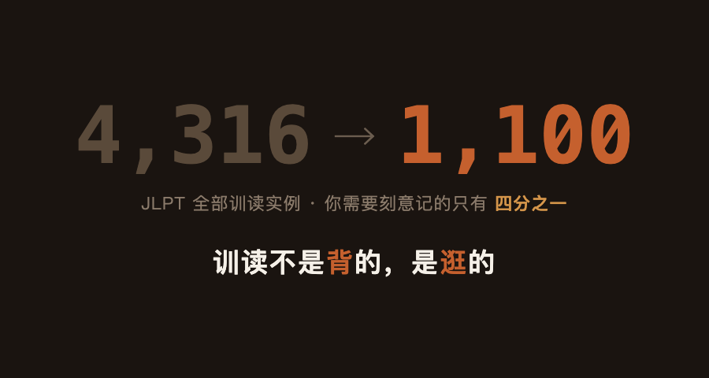
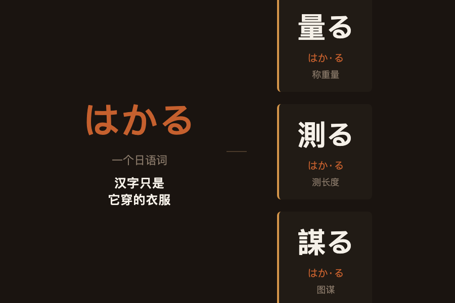
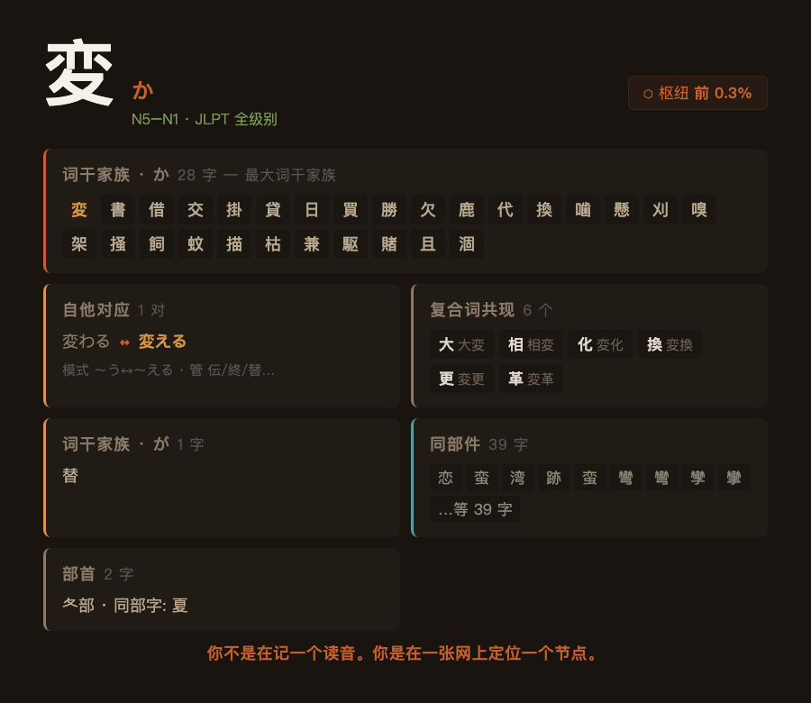
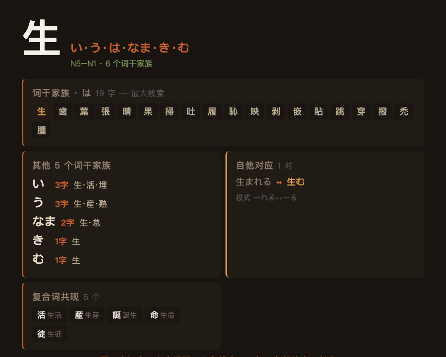
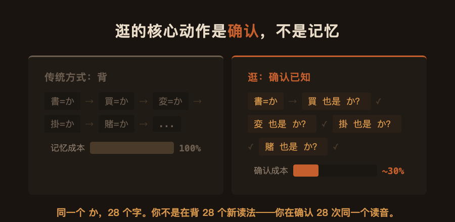
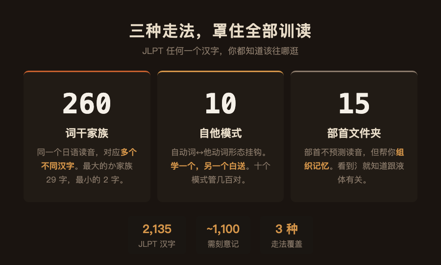
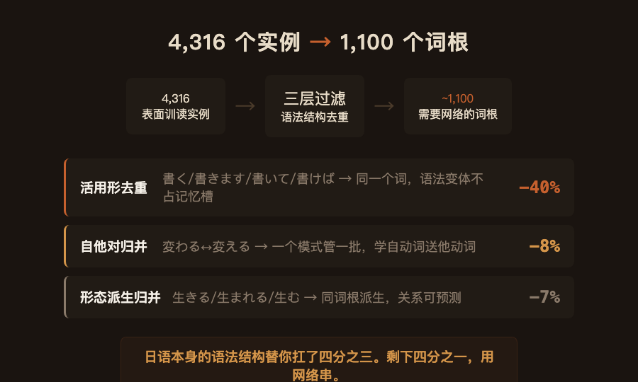
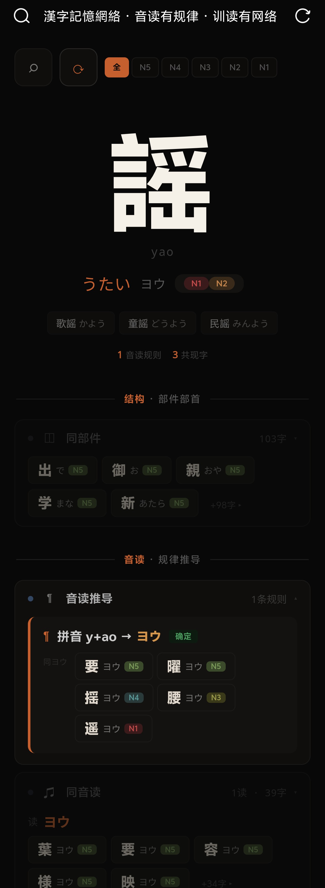
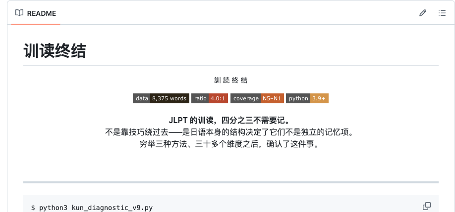

# 训读的终极答案：不是背，是逛

*图：4,316 个表面训读实例，过滤后剩约 1,100 个需要刻意记。训读不是背的，是逛的。*

你打开 Anki，今天要背 50 张卡。每张卡上一个汉字，两三种读法。这张是「書」——昨天读「か」、今天读「しょ」。你已经分不清哪个是音读哪个是训读。也不知道「書きます」和「書いて」为什么要各占一张卡。

你盯着屏幕，开始怀疑一件事——我记忆力是不是有问题？

**不是你记忆力有问题。**是我把 JLPT 全部词汇跑了一遍之后，数据说的：4,316 个表面上的训读实例，你需要刻意记的，只有约 1,100 个。剩下四分之三，是日语本身的语法结构替你扛了——活用形、自他对、形态派生，它们本来就不应该作为独立的记忆项存在。

剩下的 ~1,100 个词根，也不是一盘散沙。它们之间连着六种你可以用的关系——每一种都让下一个词根更容易记住，因为你是在已有锚点上挂新东西，不是在一片空白里硬刻。

训读不是背的。**是逛的。**

---

## 先扭一个视角

「訓読み」这个词本身就在误导你。听起来像是"汉字的日本发音"——每个汉字自带一种或几种日语读法，你的任务是把它们配对记住。

不是这样的。

日语里有一个动词，读作「はかる」。意思是量、测、估计。当你用它称重量，写成「量る」。测长度，写成「測る」。图谋不轨，写成「謀る」。日语里只有一个「はかる」——你不需要记三个汉字的三个训读。你学的是一个日语词，它有三种汉字写法。

把这个视角扭过来。**训读不是汉字的日本发音，是和语词的汉字书写方式。**扭过来之后，一堆你以前觉得混乱不堪的东西突然清楚了。

**你学的是一个日语词。汉字只是它穿的衣服。**

*图：日语里只有一个「はかる」——量る（称重）、測る（测长）、謀る（图谋）是三种写法，不是三个词。*

---

## 逛一个字：変

拿一个具体的字。

「変」。N5 就出现了，贯穿 N5 到 N1。你不知道它的训读「か」连着谁的时候，只能死记「変＝か」。一旦开始逛——

*图：「変」的四张网——か家族 28 字（最大词干家族）、自他一对、复合词 6 个、同部件 39 字。*

**词干家族。** 这是最狠的一招。「変」读 か。同一个 か，JLPT 里还有 27 个字：書、買、借、掛、換、勝、兼、交、代、駆、飼、枯、嗅、噛、欠、架、賭、描、刈、懸、掻、蚊、鹿、貸、且、涸、嗄。这是 260 个词干家族里最大的一族。

你在 N5 学了「書＝か」——書く、書き方。到 N4 遇到「買＝か」——買う、買い物。到 N3 遇到「変＝か」——変わる。到 N2 遇到「掛＝か」——掛かる、掛ける。到 N1 遇到「賭＝か」——賭ける。一个读音，贯穿五个级别，二十八个字。你不是在背二十八个新读法——**你在确认二十八次同一个读音。确认的成本，大约是全新记忆的三成。**

**自他对应。** 変わる（自己变）↔ 変える（人为让它变）。模式是 〜う↔〜える。学会这一个模式，「変」的训读用法少了一半。同一个模式管着伝わる↔伝える、終わる↔終える、替わる↔替える。**不是一条一条记，是一个模式管一批。**

**复合词共现。** JLPT 里「変」和这些字一起出现：大、相、化、換、更、革——大変、相変、変化、変換、変更、変革。你在 N5 学了「大変」（たいへん），到 N3 遇到「変化」（へんか）——「変」你已经见过了。每遇到一次，就是一次免费复习。

**同部件。** 39 个字共享「変」的部件结构——恋、蛮、湾、跡……他们之间没有读音规律。没关系。部件的意义不是预测读音，是视觉锚定——你看到这个结构，就知道它是"这一类的字"。

一个 N5 汉字，四张网同时罩着它。你不是在记一个读音。**你是在一张网上定位一个节点。**

---

## 逛第二个字：生

跟「変」不一样——「変」的词干家族只有 か 一个主线，「生」同时挂在六个词根上。

*图：「生」的六个词干家族——最大的是「は」家族 19 个字，串 N5 到 N1。*

重点看「は」。点开这个家族：歯、葉、生、張、晴、果、掃、吐、履、恥、映、剥、嵌、貼、跳、穿、撥、禿、腫——19 个字，共享同一个读音 は。你在 N5 学了「生＝い」。到 N4 遇到「歯＝は」——你不是在记一个新读法，你是在确认：歯也读 は。到 N3 遇到「映＝は」——还是 は。到 N1 遇到「剥＝は」——剥く、剥がす。还是 は。

一个は，N5 串到 N1。每遇到一个新汉字，做的不是背，是确认。

自他对这边，生まれる（自己出生）↔ 生む（生出来）。复合词这边，生活、生産、誕生、生命、生徒——每读一篇 JLPT 文章，这些词排着队帮你复习。

「変」告诉我们：一个 N5 汉字可以同时挂在四张网上——词干家族、自他对、复合词、部件——每一张网都在帮你省力。「生」告诉我们：同一个汉字可以挂在六个不同的词根上，每一条线索都能串一长串。两个字，两种逛法。后面的字——你在 JLPT 里遇到的每一个字——逛法不离这两种。

*图：逛的核心动作是确认——同一个读音，第一次是记，后面二十七次是确认。确认成本约为全新记忆的三成。*

---

## 三种走法

上面两个字，把逛法演示完了。下面把三种走法摊开。记住这些，JLPT 任何一个汉字，你都知道该往哪逛。

*图：三种逛法速查——词干家族 260 个、自他模式 10 个、部首文件夹 15 个。*

**沿着词干逛。** 同一个日语读音，对应多个不同汉字。260 个词干家族，最大的「か」家族 29 个字，最小的 2 个字。

*图：260 个词干家族中最大的 12 个。每族共享同一个日语读音。*

学到新汉字，先问一句——它是不是某个已知家族的成员？学到「換」——想「換＝か？是不是跟書、買一样读 か？」一秒钟确认，省掉一次全新记忆。

**沿着自他逛。** 日语里有一类动词描述"自己变成那样"——自动词。另一类描述"人为让它变成那样"——他动词。这两类之间有固定的形态挂钩。你学到其中一个，另一个白送。

*图：10 个自他对应模式。学一个，管一批。*

十个模式，学一次终身受用：上がる↔上げる、流れる↔流す、開く↔開ける、出る↔出す、切れる↔切る、変わる↔変える、立つ↔立てる、並ぶ↔並べる、止む↔止める、助かる↔助ける。

看到一个 〜める 结尾，自动词大概率是 〜まる。看到 〜げる，自动词大概率是 〜がる。不是一条一条记——是一个模式管一批。

**沿着部首逛。** 部首不能预测读音——我跑过数据，拿部首猜读法跟抛硬币差不多。但部首能帮你组织记忆。

*图：15 个最大的部首文件夹。不预测读音，但告诉你含义范围。*

水部（氵）在 JLPT 里有 84 个字。它们的训读各不相同，但全部跟液体有关：水＝みず、氷＝こおり、汁＝しる、油＝あぶら、海＝うみ、泳＝およ、流＝なが、消＝き、深＝ふか、浅＝あさ。你不是在背 84 个随机读音——你是在一个「液体相关」的文件夹里归档 84 个字。

手部（扌）76 个字——全部跟手部动作有关。心部（忄/心）——感情和心理状态。人部（亻）——人和人的行为。

**逛的核心动作是确认，不是记忆。**

---

## 数据是怎么来的

上面说的 4,316、1,100、260、10——这些不是估出来的。

**第一步：把 JLPT 全部词汇拆成 (汉字, 读音) 对。** 数据来源是 JLPT N5 到 N1 的全部词汇表，覆盖 2,135 个汉字，每个词标注了汉字写法、假名读音、读音类型（音读/训读）。我只取训读——得到 4,316 个 (汉字, 训读) 实例。这 4,316 个实例就是"表面上你需要记的东西"。

**第二步：剔除不该独立记的。** 我把这 4,316 个实例跑过三个过滤器：

- **活用形去重。** 「書く」「書きます」「書いて」「書けば」——这四个是不同的词形，但它们是同一个动词。如果你已经知道「書」读「か」，你不需要为每一种活用形新增一条记忆。活用形是语法规则，不是读音知识。这一层去掉约 40% 的冗余。
- **自他对归并。** 「変わる」和「変える」——自动词和他动词。它们共享同一个词根「変＝か」，只是词尾不同。学会 〜う↔〜える 这一个模式，两个词变成一个记忆项。这一层去掉约 8%。
- **形态派生归并。** 「生きる」「生まれる」「生む」——同一个词根「生」的三种派生。它们之间的关系是形态的、可预测的，不需要各自独立记忆。这一层去掉约 7%。

三层过滤之后，剩下的 ~1,100 个是词根级别的、需要用网络来组织的记忆项。压缩比的每一层都有具体的过滤逻辑和计数，不是我拍脑袋说的。

*图：4,316 个实例 → 三层过滤 → 1,100 个词根。每一层过滤掉的是日语语法结构替你扛的部分。*

**第三步：建网。** 对剩下的 ~1,100 个词根，我跑了三个构建：

- **词干家族。** 把训读词干相同的汉字聚到一起。不是手工分组——用 Python 脚本扫描全部 2,135 个汉字的训读，提取词干（去掉送假名后缀），建立 `词干 → 汉字集合` 的倒排索引。得到 260 个家族，最大的か家族 29 个字。
- **自他模式。** 不是从教科书上抄那 10 个模式——是写了一个形态分析器，扫描全部 JLPT 动词，找自动词和他动词之间的形态对应关系（〜う↔〜える、〜まる↔〜める 等）。找到了 10 个高频模式，每个模式的覆盖率用实际数据验证过。
- **复合词共现。** 从 JLPT 词汇表中提取所有包含目标汉字的复合词，建立汉字之间的共现关系。「変」和「大」共同出现在「大変」里——这个关系不是推断的，是从词汇表里直接提取的。

**验证方式。** 每一步都不是"我觉得应该是这样"——是用数据回答的。词干家族的成员都经过了交叉验证（同一个词干读法在至少两个不同的 JLPT 词中出现）。自他模式的覆盖率用实际动词对数量算的。压缩比每层都有去重前后的计数对比。

**核心结论用数据说就是：** 4,316 个表面训读实例，日语语法结构替你扛掉 3,200 个，剩下 ~1,100 个用三种走法串起来。你不是要背 4,316 个东西——你是要在 1,100 个节点上逛。

---

## 回到那张 Anki 卡

现在回到你打开 Anki 的那个瞬间。

你打开的不是 50 张需要独立记忆的卡。你打开的是一张网。每个汉字的训读，不是它自己发明的发音——是一个日语词给它穿的衣服。你每遇到一个"新"读法，做的不是背：是把新来的汉字放进它该去的词干家族、确认一次自他模式、在部首文件夹里给它一个位置。

**确认 28 次同一个读音，比背 28 个独立读音省四分之三的力气。**

4,316 个表面实例，日语语法替你扛了四分之三。剩下 ~1,100 个词根，用三种走法串起来——词干家族 260 个、自他模式 10 个、部首文件夹 15 个。JLPT 任何一个汉字，你都知道该往哪逛。你的任务不是背 4,316 个东西，是在 1,100 个节点之间逛。

*图：kanji-kun 网站——点任意汉字，看它连着谁。*

::: cta
**www.5mcv4he.cn/yomeru.html**

全部代码、数据、分析脚本已开源：

**github.com/5Mcv4He/kanji-kun**
:::
