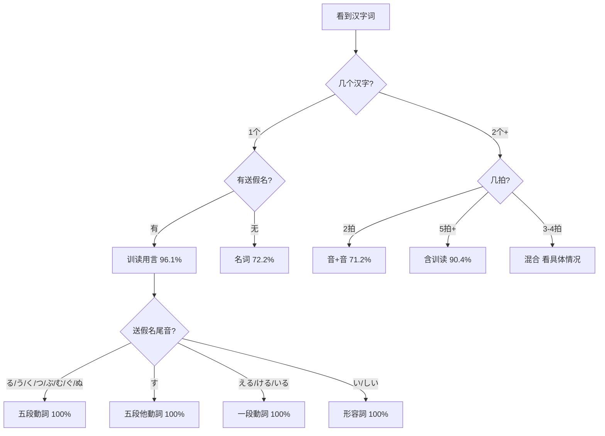
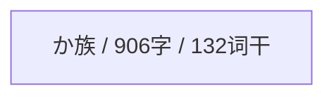
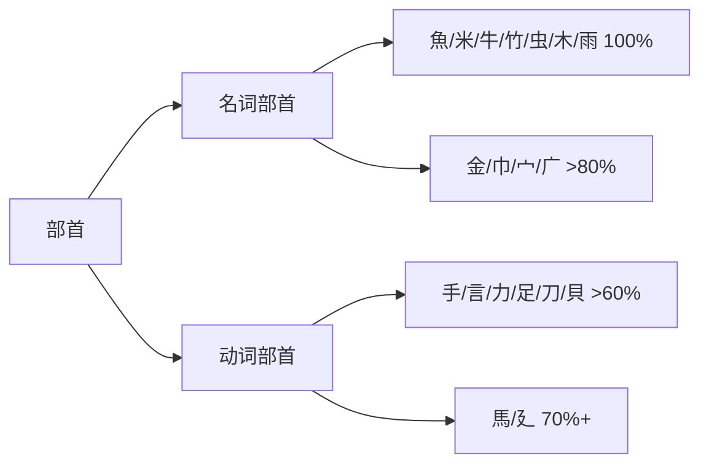

# 训读知识图谱可视化 · Kun-Yomi Knowledge Graphs

> Mermaid 图表——可视化记忆 > 文字表格

---

## 1. 训读判定决策树



---

## 2. 最高频训读词干网络

```mermaid
graph LR
    い[い / 128次]
    い --> "井 入 凍 出 容"
    か[か / 128次]
    か --> "且 交 代 借 兼"
    あ[あ / 122次]
    あ --> "上 会 合 在 当"
    う[う / 115次]
    う --> "享 受 埋 売 失"
    と[と / 95次]
    と --> "取 問 富 戸 採"
    つ[つ / 94次]
    つ --> "付 吊 告 尽 接"
    こ[こ / 89次]
    こ --> "凝 処 媚 子 小"
    み[み / 83次]
    み --> "三 実 満 見 身"
```

---

## 3. 最大词源家族



---

## 4. 自他动词模式分布

```mermaid
graph LR
    〜る↔〜す[〜る↔〜す / 2374对]
    〜く↔〜ける[〜く↔〜ける / 1247对]
    〜れる↔〜る[〜れる↔〜る / 878对]
    〜れる↔〜す[〜れる↔〜す / 716对]
    〜まる↔〜める[〜まる↔〜める / 469对]
    〜む↔〜める[〜む↔〜める / 348对]
```

---

## 5. 部首→词类预判



*Mermaid图表可在支持Mermaid的Markdown阅读器中渲染*